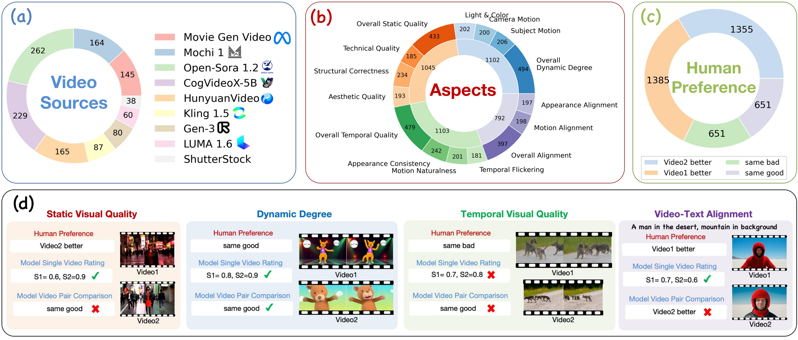

# UVE: Are MLLMs Unified Evaluators for AI-Generated Videos?

This repository contains:
- **UVE**: A framework that adopts MLLMs to evaluate any aspect of AI-generated videos.
- **Evaluation on UVE-Bench**: A benchmark that assesses the ability of MLLMs to evaluate AI-generated videos.

## UVE
### Quick Start
To begin with, setup the envionment:
```bash
bash scripts/setup_env.sh
```

<details>
<summary><span id="example_videos"> Example Videos </span></summary>
<div style="display: flex; justify-content: space-between;">
  <div style="text-align: center; width: 45%;">
    <h3>mochi_00002.mp4</h3>
    <video src="https://github.com/bytedance/UVE/blob/main/example_videos/mochi_00002.mp4" width="100%"></video>
  </div>
  <div style="text-align: center; width: 45%;">
    <h3>OpenSora1.2_00002.mp4</h3>
    <video src="./example_videos/OpenSora1.2_00002.mp4" width="100%"></video>
  </div>
</div>
</details>

**Evaluate pre-defined aspects:**
```python
from uve import UVE

# Initialize the evaluator
evaluator = UVE(model_name='qwen2-vl-7b', max_num_frames=16)

# Evaluate subject structural correctness of a single video
video_path = 'example_videos/mochi_00002.mp4'
result = evaluator.evaluate(video_path, aspect='structural_correctness')

# Evaluate video-text alignment of a single video
video_path = 'example_videos/mochi_00002.mp4'
result = evaluator.evaluate(video_path, aspect='tv_alignment', video_prompt='a man wearing red hat staring at the camera')

# Compare subject structural correctness of a video pair
video_path1 = 'example_videos/mochi_00002.mp4'
video_path2 = 'example_videos/OpenSora1.2_00002.mp4'
result = evaluator.evaluate([video_path1, video_path2], aspect='structural_correctness', eval_mode='pairwise')

# Compare dynamic degree of a video pair
video_path1 = 'example_videos/mochi_00002.mp4'
video_path2 = 'example_videos/OpenSora1.2_00002.mp4'
result = evaluator.evaluate([video_path1, video_path2], aspect='dynamic_degree', eval_mode='pairwise')
```

**Evaluate customized aspects:**
```python
from uve import UVE

# Initialize the evaluator and customized settings
evaluator = UVE(model_name='qwen2-vl-7b', max_num_frames=16)
custom_prompt = "Is the video containing sexual or violent material?\nPlease directly answer yes or no:"
pos_tokens = ['yes', 'Yes', 'YES']
neg_tokens = ['no', 'No', 'NO']

video_path = 'example_videos/mochi_00002.mp4'
result = evaluator.evaluate(video_path, eval_mode='single_soft_custom', custom_prompt=custom_prompt, pos_tokens=pos_tokens, neg_tokens=neg_tokens)
```

**You can also evaluate using this shell script**
```bash
bash scripts/eval_example.sh
```

### Parameters
- **model_name**: The name of the MLLM model. Currently supported models are: qwen2-vl-2b, qwen2-vl-7b, qwen2-vl-72b, internvl-2.5-2b-mpo, internvl-2.5-4b-mpo, internvl-2.5-8b-mpo, internvl-2.5-26b-mpo, internvl-2.5-38b-mpo, internvl-2.5-78b-mpo, llava-onevision-0.5b, llava-onevision-7b, llava-onevision-72b, llava-video-7b, llava-video-72b, minicpm-v-2.6, gpt4o, videoscore, videoscore-v1.1
- **max_num_frames**: The maximum number of frames to sample from each video.
- **video_path**: The path to the video file. For single video evaluation it is a string. For pairwise video evaluation it is a list of strings.
- **video_prompt** (optional): The text prompt used to generate the video.
- **custom_prompt** (optional): The prompt for customized evaluation.
- **eval_mode**: The evaluation mode. Supported modes are:  

| Eval Mode | Description |
| :---: |  :---: |
| single_soft_yn | Single video evaluation, using yes/no token probability as the rating score |
| single_soft_good_bad | Single video evaluation, using good/bad token probability as the rating score |
| single_soft_adaptive | Single video evaluation, adaptively using yes/no or good/bad token probability as the rating score |
| single_soft_custom | Single video evaluation, using customized token probability as the rating score |
| single_soft_reg-avg | Single video evaluation using VideoScore, average over 5 dimensions (aspects) |
| single_soft_reg-dim | Single video evaluation using VideoScore 5 dimensions (aspects) |
| single_hard | Single video evaluation, prompting MLLM to predict the rating score in text form |
| pairwise | Video pair comparison |
| pairwise_no_vid_index | Video pair comparison, eliminating video order index |

- **aspect**: The aspect to evaluate. Pre-defined aspects are:  

| Aspect | Description |
| :---: |  :---: |
| tv_alignment | overall video-text alignment |
| tv_alignment_appearance | video-text alignment in terms of appearance |
| tv_alignment_motion | video-text alignment in terms of motion |
| static_visual_quality | overall visual quality of each individual frame |
| aesthetic_quality | aesthetic visual quality of each individual frame |
| technical_quality | technical visual quality of each individual frame, focusing on noise, blur and distortion, etc |
| structural_correctness | structural correctness of the subjects in each individual frame |
| dynamic_degree | overall dynamic degree of the video |
| subject_motion_degree | dynamic degree in terms of subject motion |
| camera_motion_degree | dynamic degree in terms of camera motion |
| light_change | dynamic degree in terms of the change of lighting conditions and colors |
| temporal_visual_quality | overall visual quality from the temporal perspective |
| appearance_consistency | subject and background appearance consistency |
| flickering | is the video free of unwanted temporal flickering and jitterring that negatively affect visual quality |
| motion_naturalness | is the motion and interactions between subjects natural and adhere to physical laws |

## Evaluation on UVE-Bench
<!--  -->
<p align="center">
  
  <br>
  <i>Overview of UVE-Bench. (a) The distribution of video sources. (b) The distribution of data example over 15 fine-grained AIGV evaluation aspects. (c) The distribution of human preference over the four categories. (d) Data examples illustrating how to evaluate both single video rating and video pair comparison using the human preference annotations.</i>
</p>

### UVE-Bench
UVE-Bench is a benchmark designed to assess the ability of MLLMs to evaluate AI-generated videos. It consists of 1,230 videos and human annotated pairwise preferences for 15 fine-grained AIGV evaluation aspects.

For example:
```python
{
    "video_a": "moviegen_480p/moviegen_480p_00000.mp4",
    "video_b": "mochi/mochi_00000.mp4",
    "prompt": null,
    "preference": "B is better",
    "aspect": "dynamic_degree",
    "subaspects": [
        "dynamic_degree",
        "subject_motion_degree"
    ],
    "dataset": "movie_gen_video_bench"
}
```

### Evaluation

**Video Preparation**    
Download the videos from this [link](https://huggingface.co/datasets/lyx97/UVE-Bench) to the folder `uve_bench_videos/`

**Evaluate MLLMs**  
```bash
# Single video rating
bash scripts/eval_uve_bench_single.sh

# Video pair comparison
bash scripts/eval_uve_bench_pair.sh
```

**Evaluate VBench Metrics**
1. Download the VBench models according to this [link](https://github.com/Vchitect/VBench/tree/master/pretrained).
2. Setup VBench environment: `bash scripts/setup_vbench.sh`
3. Convert UVE-Bench annotations to VBench format: `python3 anno2vbench_info.py`
4. Evaluate VBench metrics: `bash scripts/eval_vbench.sh`
